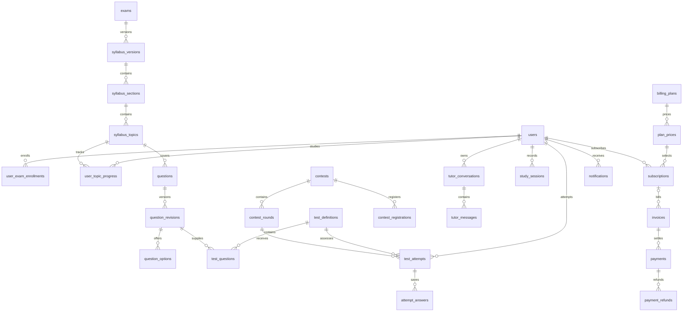

# TNPSC AI Tutor Data Model

`tnpsc_ai_tutor.sql` creates a new MySQL 8.4 database with 37 InnoDB tables and five reporting views. It models the original learning workflows in `../index.html`; it does not connect the HTML prototype to a backend. The later Community frontend uses browser storage and is not yet represented by these tables.

## Create the Database

Open `tnpsc_ai_tutor.sql` in MySQL Workbench and execute it, or run this inside the MySQL command-line client:

```sql
SOURCE D:/Exam-Pre/database/tnpsc_ai_tutor.sql;
```

The script creates and selects `tnpsc_ai_tutor`. To use another database name, change its `CREATE DATABASE` and `USE` statements before execution. The executing account needs permission to create the database, tables, indexes, foreign keys, and views.

This is a first-install schema, not a migration for an existing application database. It does not drop tables, disable foreign keys, or silently skip existing tables. A second run stops at the first existing table. MySQL DDL commits independently, so fix an import error before continuing; wrapping this file in a transaction does not undo earlier table creation.

The schema script contains no user records, passwords, payment credentials, or fabricated performance data. Curriculum content and commercial prices are not seeded by the DDL. Set `syllabus_sections.display_order` to **Tamil = 1, General Studies = 2, Aptitude = 3** when importing the application's curriculum.

## Optional Test Data

For a **fresh, empty development database**, execute `tnpsc_ai_tutor_test_data.sql` after the schema. In MySQL Workbench, open the file and execute the entire script. From the MySQL command-line client:

```sql
SOURCE D:/Exam-Pre/database/tnpsc_ai_tutor_test_data.sql;
```

The seed inserts **268 linked records into all 37 tables**. The five views populate automatically; there are no duplicated dashboard or leaderboard totals. This does not connect the HTML prototype to MySQL.

| Fixture | Included data |
| --- | --- |
| Accounts | Kavya (ID 1), Arun (ID 2), new learner Meena (ID 3), instructor (ID 4), admin (ID 5); themes and language preferences |
| Curriculum | One prototype syllabus, three ordered sections, all 15 topics from the HTML, enrollments, dated goals and progress |
| Tests | Six English-text questions with four options each, mini mock, Tamil practice, two contest test definitions, nine attempts and complete answer snapshots |
| Dashboard | Mock trend, incorrect/skipped questions, revision due date, reading/tutor/test activity, unfinished practice, new-learner empty state |
| Contests | Completed two-round contest and an upcoming contest with registrations |
| Tutor | Topic, section, general and attempt-review conversations, welcome notes, text, voice transcripts, draft and archived chat |
| Billing | Free/Plus/Institute plans, sample features and prices, active/past-due/trial subscriptions, paid/open invoices, captured/failed payments, partial refund and sanitized webhooks |
| Inbox | Read/unread notifications and fictional institute enquiries |

All records are fictional. Curriculum weights mirror the prototype, not a verified official exam notification. Mini tests are not full-length mock papers. Prices are illustrative, tax is zero for fixtures, and `demo` provider IDs have no connection to a payment gateway. Emails use `example.test`; passwords are NULL and session/challenge fixtures are expired or revoked, so these are **not working login accounts**. Audio object keys are placeholders: upload real test audio separately before testing playback. Tamil content columns remain available for localized content; the fixture questions use English text/transliteration.

Historical activity is anchored at 08:00 UTC yesterday relative to the import. The upcoming contest is five days after that anchor, and the in-progress practice expires five minutes after import. Dates age naturally; use a newly created disposable database to refresh the demo. Target years are sample goals, not announced exam dates.

The import requires `CREATE ROUTINE`, `EXECUTE` and `ALTER ROUTINE` permissions as well as table read/write permissions. It creates a temporary helper procedure, checks every base table is empty, inserts within one transaction, commits on success and drops the helper. Any insert failure rolls back all seeded rows. A rerun on populated tables is rejected without modifying them. Run outside an existing transaction, with no concurrent writers, and stop on SQL errors (do not use `--force`). If an import fails, the helper may remain; the next run replaces only this named helper, never application tables or existing rows.

Expected examples after import:

```sql
-- Kavya: 4.5/9 then 7.5/9. Arun: 6/9.
SELECT user_id, attempt_id, scored_marks, maximum_marks, accuracy_percentage
FROM v_attempt_results WHERE test_kind = 'mock' ORDER BY user_id, submitted_at;

-- Kavya: rank 1, 9/9, 100th percentile. Arun: rank 2, 6/9, 50th percentile.
SELECT * FROM v_contest_leaderboard ORDER BY contest_id, contest_rank;

SELECT * FROM v_daily_learning_activity WHERE user_id = 1 ORDER BY activity_date;
SELECT * FROM notifications WHERE user_id = 1 AND read_at IS NULL;
```

## Table Groups

| Area | Tables | Purpose |
| --- | --- | --- |
| Accounts | `users`, `user_preferences`, `auth_sessions`, `auth_challenges` | Profiles, light/dark mode, language, sidebar state, login sessions, OTP and password-reset challenges |
| Curriculum | `exams`, `syllabus_versions`, `syllabus_sections`, `syllabus_topics` | Versioned exam pattern, ordered sections and topics, English/Tamil text |
| Personal learning | `user_exam_enrollments`, `user_learning_goals`, `user_section_preferences`, `user_topic_progress`, `topic_study_events` | Exam targets, goal history, accordion preferences, explicit completion, revision dates and completion history |
| Questions and tests | `questions`, `question_revisions`, `question_options`, `test_definitions`, `test_questions`, `test_attempts`, `attempt_answers` | Reviewed question versions, fixed test contents, resume/autosave, grading and historical answers |
| Competition | `contests`, `contest_rounds`, `contest_registrations` | Weekly contest schedules, rounds, registrations and eligibility |
| Tutor and activity | `media_assets`, `tutor_conversations`, `tutor_messages`, `study_sessions` | Scoped conversations, drafts, voice transcripts, audio references, generation status and active study time |
| Billing | `billing_plans`, `plan_features`, `plan_prices`, `subscriptions`, `invoices`, `payments`, `payment_refunds`, `payment_webhook_events` | Versioned prices, entitlements, subscriptions, billing records, payment retries and webhook deduplication |
| Institute enquiries | `institute_enquiries` | The current Batch Access / Contact Sales flow; full institute and classroom management is not implemented by this schema |
| Inbox | `notifications` | Per-user notifications, unread state, expiry and links to related records |

## Main Relationships



The SQL file is the authoritative, complete model. Composite foreign keys also enforce exam-version consistency, conversation ownership, answer-option ownership, and payment/invoice ownership.

## Dashboard Data

| Dashboard content | Source |
| --- | --- |
| Today and weekly active time | `v_daily_learning_activity.active_seconds`, filtered by the learner's local dates |
| Daily and weekly targets | Latest `user_learning_goals` row effective on each date; add seven daily targets for a weekly goal |
| Completed study sessions | Topic-completion events and fully graded tests in `v_daily_learning_activity` |
| Study streak | Consecutive local dates with positive active time, a topic completion, or a submitted graded test |
| Subject completion | `user_topic_progress.study_status = 'studied'`, joined to curriculum topics; opening chat is not completion |
| Subject accuracy | `v_subject_practice_accuracy`; correctness divided by answered questions, not questions merely displayed |
| Continue learning | In-progress `test_attempts` ordered by `last_saved_at`, and unfinished topics ordered by `last_opened_at` |
| Revision priorities | `v_latest_question_outcomes` with incorrect/skipped outcomes, plus `user_topic_progress.next_revision_at` |
| Mock performance trend | `v_attempt_results` filtered by `test_kind = 'mock'`; score percentage includes penalties and skipped questions |
| Personal contest result | Contest attempts in `v_attempt_results`; compare equivalent rounds/test lengths using score percentage |
| Published rank and percentile | `v_contest_leaderboard`; absent until publication and completion of every contest round |

An absent reporting row means **no activity/results**, not zero accuracy or a fabricated rank. The API should left-join these views onto the enrolled curriculum so untouched subjects still appear. Streaks and goal comparisons are computed by the backend from the local-date records; no stale duplicate dashboard totals are stored.

## Backend Write Rules

The schema enforces local constraints and relationships. These rules require application transactions because they involve multiple rows, authorization, or external services:

1. **Account creation:** normalize contact details; create the user and preferences, then an enrollment and initial dated goal. Hash passwords with a password-hashing algorithm. Only hashes/HMACs of authentication tokens are stored.
2. **Publish curriculum/tests:** verify section/topic totals, the question's curriculum version, and exactly one correct option with at least two options per question. The unique generated index prevents multiple correct options, but publication must also reject zero correct options. This model currently supports single-choice questions. Do not mutate published question revisions, question-topic assignments, test membership, or pricing rows already used historically; create a new revision/price instead.
3. **Start a test:** validate availability, registration, timing, and attempt policy. In one transaction insert the attempt and all `attempt_answers`, copying marks and question order from the published test. The unique request key makes retries idempotent. Contest attempts require a registered user and the correct round/test combination; the backend also rejects withdrawn/disqualified users and out-of-window attempts.
4. **Autosave:** check attempt ownership and `attempt_status = 'in_progress'`, update answers and cursor, and increment `lock_version` with a compare-and-swap update. Do not accept client-supplied correct answers or awarded marks. The selected option must belong to the same question revision, enforced by a composite foreign key.
5. **Submit and grade:** lock the attempt row, reject duplicate or unauthorized state transitions, calculate every outcome server-side, and mark it graded in the same transaction. Populate `submitted_at`, `graded_at`, and the submission's local date. Reporting suppresses partial grading or missing question rows. Reviewed attempts remain immutable; invalidate an attempt explicitly rather than changing its historical answers.
6. **Continue a tutor topic:** look up the learner's active conversation for that topic, or create one under a per-user/topic lock. Multiple conversations are allowed over time. Persist a welcome message once, allocate sequence numbers while locking the conversation, and use request keys for retries. Create the assistant placeholder in the originating conversation before calling the LLM, then update that message even if the learner changes topics. `reply_to_message_id` cannot reference another conversation.
7. **Record learning:** explicitly update topic progress and append a deduplicated completion/revision event in one transaction. Derive `next_revision_at` from the revision policy. Validate heartbeat duration, reject overlapping concurrent study sessions, exclude inactive/background time, and split sessions at local midnight. UTC timestamps and the captured local date/timezone serve different purposes. Count active time from `study_sessions` only; do not add attempt time again.
8. **Publish contests:** validate that round windows fall inside contest windows. Once all eligible attempts are settled, set the contest to published and set `results_published_at`. All rounds are required in this initial model. Rank sorts by total score descending and active time ascending; exact ties share a rank. Percentile uses the proportion of eligible finishers with an equal or worse score/time ordering. Never combine ordinary mock scores or simulated scoreboard data with contest results.
9. **Process billing:** verify webhook signatures before inserting a sanitized event; process an event and its payment/invoice/subscription changes atomically. Lock the invoice/payment to prevent aggregate overpayment or over-refund. Ensure the selected plan price and invoice currency agree. Enforce the application's policy for overlapping active subscriptions. A zero-price plan needs no zero-amount payment record. Store provider IDs only, never PAN/CVV, payment OTPs, or secret provider credentials.
10. **Authorize access:** user IDs in foreign keys do not provide row-level authorization. Every API query must enforce the authenticated user or staff permissions. Use a least-privilege application DB account. Generate private signed audio URLs from `media_assets.storage_object_key`; the database does not contain audio binaries. Account closure and historical-data purge are explicit workflows: foreign keys use restrictive deletion to preserve linked results and billing records.

All application database connections must use `SET time_zone = '+00:00'` and `utf8mb4`. `DATETIME(6)` columns do not themselves convert timezones. Use backend timezone handling for local dates rather than depending on the server's installed timezone tables.

## MySQL References

- [CHECK constraints and their limitations](https://dev.mysql.com/doc/refman/8.4/en/create-table-check-constraints.html)
- [Foreign keys and referenced indexes](https://dev.mysql.com/doc/refman/8.4/en/create-table-foreign-keys.html)

## Validation

Validated on **MySQL 8.4.11** in a disposable, network-isolated container on 2026-09-12. The DDL created **37 tables and five views** successfully. The tests passed for duplicate contacts, curriculum scope, invalid goals, retry deduplication, single-correct-option uniqueness, answer ownership, grading bounds, ungraded-result exclusion, all-skipped accuracy, contest registration and publication, complete-round eligibility, rank/percentile calculation, disqualification, tutor/audio ownership, active-time bounds, daily aggregation, invoice arithmetic, payment ownership/currency, webhook retries, and notification ownership.

The separate seed was also validated for exact counts in every table, all five reporting views, grading, contest ranks, local dates, non-overlapping study time, billing totals and inactive authentication fixtures. A deliberately injected failure in the last table verified full transaction rollback and successful retry. Reimporting populated tables was rejected, and all 268 rows remained intact. All checks passed on MySQL 8.4.11.

Only a disposable database was populated during verification and its container was removed afterward. No existing application database was modified, and the deliverable DDL itself still contains no test data. Temporary verification scripts and screenshots were removed during final repository cleanup; they are not needed to import either SQL deliverable.
